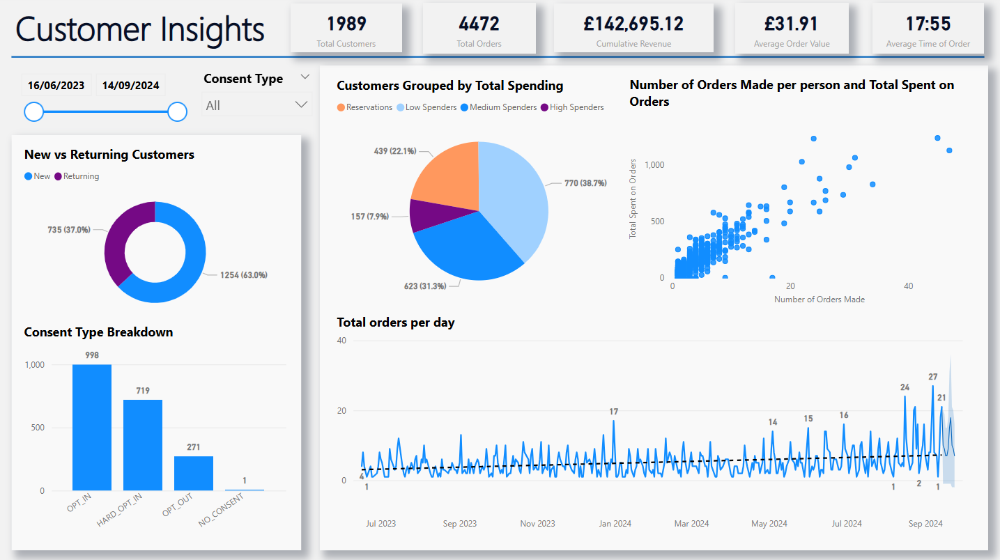
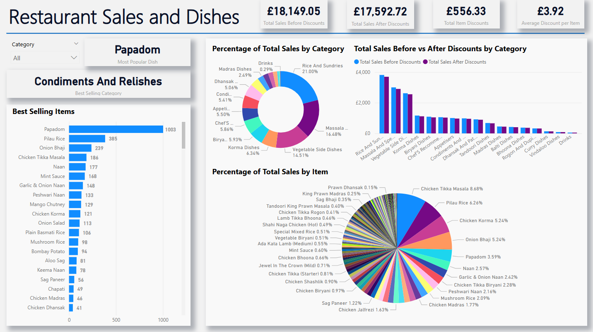
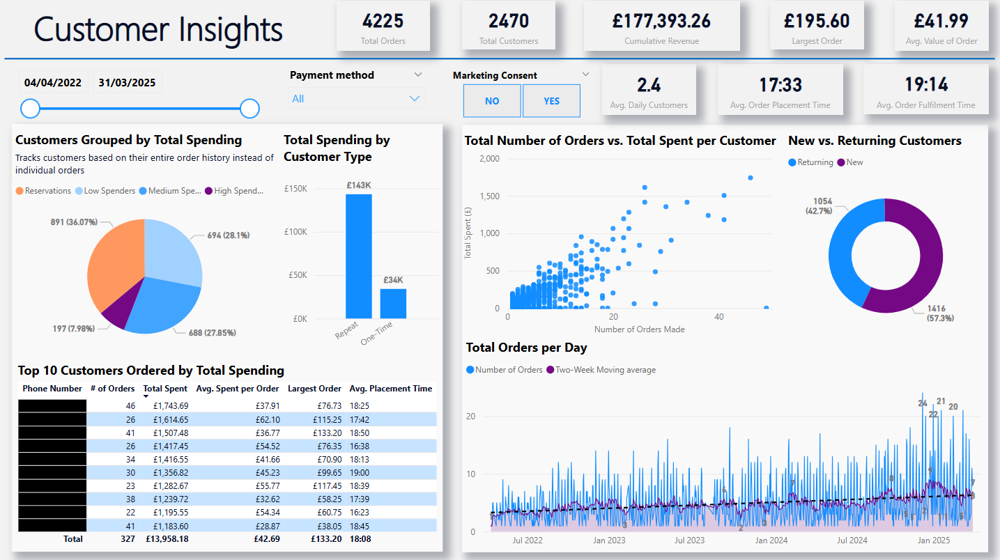
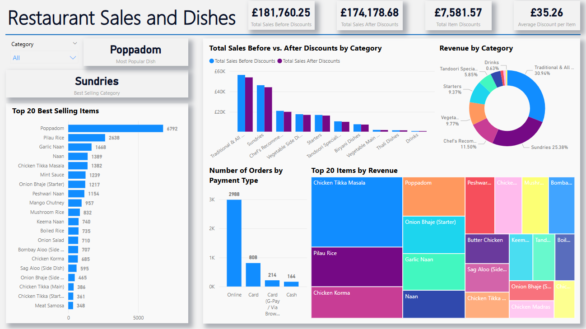

# Restaurant-Business-Intelligence

A collection of Power BI dashboards developed during my time as a Junior Data Analyst for restaurants. These dashboards were built to deliver business-critical insights in areas such as customer behaviour, sales trends and dish performance.

The data for each restaurant was extracted and stored into a series of spreadsheets which were cleaned before being loaded into Power BI. Then the data model was optimised for each restaurant through creating relationships across tables (each table being data from a single spreadsheet) for one-to-many joins such as `Category to Items`. Also, Data Analysis Expressions (DAX) were used to create custom dynamic metrics such as Total Orders and Customers, Average Order Value and the numbers of New and Returning Customers. DAX was then further utilised to create tables for customer segmentation. 

> **Note**: Due to the sensitive nature of the data, this repository contains only screenshots of the dashboards. The raw Excel spreadsheets and Power BI (`.pbix`) files have not been uploaded to protect customer privacy (e.g. names, emails, phone numbers) and confidential business data.

  
<h2>The Curry Bengal</h2>

  
  ## Customer Insights

  This dashboard provides an end-to-end analysis of customer engagement at The Curry Bengal, based on data from 16/06/2023 to 14/09/2024. It explores trends in customer acquisition, segmentation, consent types, order behaviour, and total spending.

  

  ### Visuals and Metrics

  - **New vs Returning Customers (Donut Chart)**: Highlights retention performance; a larger returning customer base suggests effective loyalty or satisfaction.
  - **Consent Type Breakdown (Bar Chart)**: Key for assessing the reach of marketing efforts and compliance with consent-based communication.
  - **Customers Grouped by Total Spending (Pie Chart)**: Segments customers into four spending brackets (High, Medium, Low, Reservations) to support targeted promotions.
  - **Number of Orders per Person vs Total Spent (Scatter Plot)**: Aids in identifying high-value customers and frequent visitors for potential loyalty programme prioritisation.
  - **Total Orders Per Day (Line Chart)**: Provides an operational view of restaurant activity and growth trends, helping to optimise staffing and kitchen workflow. Additionally, provides a forecast with a 95% confidence level in order trends.
  - **Top KPI Cards**:
      - Total Customers: 1,989
      - Total Orders: 4,472
      - Cumulative Revenue: £142,695.12
      - Average Order Value: £31.91
      - Average Time of Order: 17:55
   
  ### Insights and Conclusions
  
  - Strong base of returning customers (37%) suggests repeat satisfaction.
  - Majority of customers (over 85%) have opted in to marketing, providing scope for effective campaigning stratagies.
  - Peak activity seen in August–September, possibly influenced by promotions or seasonal trends such as school holidays.
  - Most revenue came from low and medium spenders suggests a potential to personalise offers for those groups.

 

  ## Restaurant Sales and Dishes

  This dashboard analyses sales performance down to individual dishes and categories, highlighting which items drive revenue and where discounts are most impactful. It supports data-driven menu curation and promotional strategies.

  

  ### Visuals and Metrics

  - **Category Dropdown Menu**: Enable stakeholders to explore performance by category.
  - **Best Selling Items (Bar Chart)**: Ranks dishes clearly by quantity sold - _Papadoms_ lead with 1,003 sales.
  - **Percentage of Total Sales by Category (Donut Chart)**: Reveals the most commercially important categories (e.g. _Vegetable Side Dishes_, _Rice and Sundries_, _Korma Dishes_).
  - **Total Sales Before vs After Discounts by Category (Clustered Column Chart)**: Helps identify which categories are discount-reliant and may be driving lower margins.
  - **Percentage of Total Sales by Item (Pie Chart)**: Offers a complete view of how individual items contribute to revenue - _Chicken Tikka Masala_ dominates at 8.68%.
  - **Highlight Cards**:
    - Total Sales Before Discounts: £18,149.05
    - Total Sales After Discounts: £17,592.72
    - Total Discount Value: £556.33
    - Average Discount per Item: £3.92

  ### Insights and Conclusions
  - _Papadoms_ are high-volume, low-discount items which elucidates that either their price can be safely increased or they can be bundled with other orders.
  - Categories like _Vegetable Sides_ and _Rice_ account for large sales volumes confirming their central role in meal structures.
  - Discounts are used relatively moderately, so there is potential to test promotions in underperforming categories.
  - Dish-level insights guide stock management, price revisions, and promotional planning.

  
<h2>Raj Tandoori</h2>

  
  ## Customer Insights

  This dashboard analyses customer behaviour at Raj Tandoori from 04/04/2022 to 31/03/2025. Similar to The Curry Bengal's _Customer Insights_ dashboard, the dashboard below offers a dynamic view of customer segmentation, repeat behaviour, spending patterns, and operational performance across order placement and fulfilment timelines.

  

  ### Visuals and Metrics

  - **Customers Grouped by Total Spending (Pie Chart)**: Segments customers into Reservations, Low, Medium, and High Spenders based on their full order history which helps to identify which groups to pay close attention to for marketing and promotional offers.
  - **Total Spending by Customer Type (Bar Chart)**: Highlights the importance of creating and maintaining customer loyalty by comparing the revenue contribution of repeat customers versus one-time customers.
  - **Total Number of Orders vs. Total Spent per Customer (Scatter Plot)**: Identifies valuable and frequent customers visually: those in the top-right are prime candidates for loyalty programmes.
  - **New vs Returning Customers (Donut Chart)**: Provides insights into customer acquisition versus retention efforts.
  - **Top 10 Customers Ordered by Total Spending (Table)**: Lists key customer metrics including:
    - Phone number (anonymised here)
    - Total orders placed
    - Total amount spent
    - Average spent per order
    - Largest order made
    - Average placement time for orders
  - **Total Orders Per Day (Line Chart)**: Includes a two-week moving average to smooth out short-term fluctuations and highlight underlying trends (which are also emphasised through the explicit trend line).
  - **Top KPI Cards**:
    - Total Orders: 4,225
    - Total Customers: 2,470
    - Cumulative Revenue: £177,393.26
    - Largest Order: £195.60
    - Average Order Value: £41.99
    - Average Daily Customers: 2.4
    - Average Order Placement Time: 17:33
    - Average Order Fulfilment Time: 19:14
   
  ### Insights and Conclusions

  - A strong 57.3% of customers were returning suggesting that the restaurant has been able to implement sucessful customer retention strategies.
  - Repeat customers contributed approximately £143k out of £177k total revenue.
  - Order volume has been steadily growing over time; this is also supported by an increase in repeat business.
  - Medium spenders made up a substantial share of the customer base- they can be targeted with tailored offers and loyalty programs to further improve retention.
  
   
  
  ## Restaurant Sales and Dishes

  This dashboard focuses on analysing sales performance across individual dishes, categories, and payment types at Raj Tandoori. It also aims to inform a menu composition that relfects customer preferences by replacing under-performing dishes with more well-liked ones. Additionally, by providing a greater understanding of the effects discounts are currently having, they can be better utilised to target infrequent customers by designing promotional campaigns through emails and texts.

  

  ### Visuals and Metrics

  - **Top 20 Best Selling Items (Bar Chart)**: Clearly identifies the highest-selling dishes by quantity: _Papadom_ with 6,792 sales.
  - **Total Sales Before vs After Discounts by Category (Clustered Column Chart)**: Highlights th eimpacts of discounts across different dish categories to better help with managing margins.
  - **Revenue by Category (Donut Chart)**: Shows the revenue contribution from each category where _Sundries_ and _Traditional & All Time Favourites_ are the major drivers.
  - **Number of Orders by Payment Type (Bar Chart)**: Provides insight into payment trends and indicates a heavy preference for online payments.
  - **Top 20 Items by Revenue (Treemap)**: Visualises which dishes generate the highest total revenue: _Chicken Tikka Masala_ is the largest and is followed by _Poppadom_ and _Pilau Rice_.
  - **Highlight Cards**:
    - Total Sales Before Discounts: £181,760.25
    - Total Sales After Discounts: £174,178.68
    - Total Item Discounts: £7,581.57
    - Average Discount per Item: £35.26

  ### Insights and Conclusions
  
  - Online payments dominated with almost 3,000 out of 4,225 orders being online transactions. This can advise on diversifying advertisement strategies such as leafleting (distributing take-away menus to homes) and posting ads on Google to showcase new limited-time offers and menu revisions.
  - The importance of items such as _Poppadom_, _Pilau Rice_ and _Garlic Naan_- the three highest-selling items overall- is patently shown which suggests possible small price increases can be introduced to these. Also, this is reinforced with _Sundries_ being the top-selling and top-revenue-generating category where 11 of the 20 best selling items belonging to it.
  - Discounting had a modest overall impact, so controlled promotional campaigns may be more effective than relying on giving heavy discounts.
  - _Chicken Tikka Masala_ and _Poppadom_ consistently ranked at the top across quantity sold and revenue generated. This falls in line with the wider market of Indian and Bengladeshi restaurant where these dishes are common staples in orders.
 

